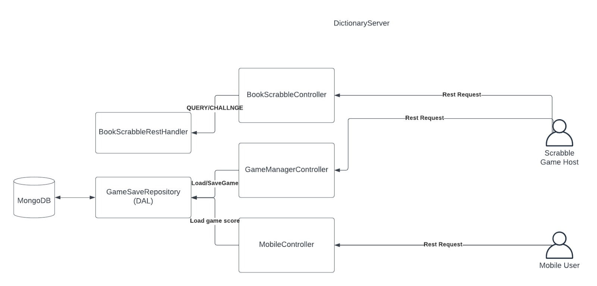
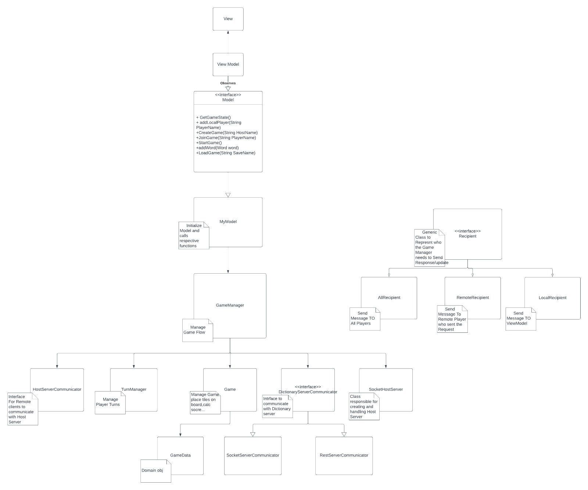
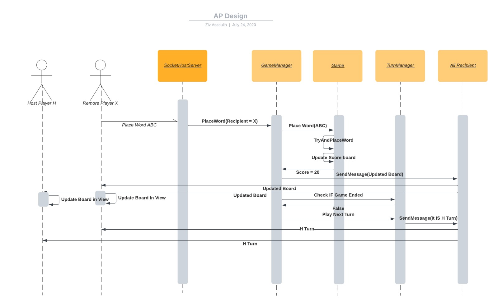

# Scrabble Game - Advanced Programming

## Install

Installation instructions for the main application (dictionary server + scrabble game client). Read the readme in `ReactApp/README.md` for instructions for the Android app.
1.	Clone this repository.
2.	Install [JDK17](https://adoptium.net/temurin/releases/?version=17).
	*	Ensure these environment variables are set correctly:
		*	`PATH` includes the `java.exe` executable.
		*	`JAVA_HOME` is set to the root directory of the Java installation (e.g. `C:\Program Files\Eclipse Adoptium\jdk-17.0.7.7-hotspot\`)
3.	Download and extract [JavaJX17](https://gluonhq.com/products/javafx/).
	*	 Set the environment variable `PATH_TO_FX` to point to the `lib` directory under the extracted directory (e.g. `C:\dev\JavaFX\javafx-sdk-17.0.7\lib`)
4.	Install [Docker Desktop](https://www.docker.com/).
5.	Install [IntelliJ](https://www.jetbrains.com/idea/).

## How to run the game

### A. Run the dictionary server

1.	Run the Docker Desktop application.
2.	Open the `DictionaryServer` directory in IntelliJ.
3.	Open the file `DictionaryServer/docker-compose.yaml` and run it (press the play button).

### B. Run the scrabble game client

#### i. Run as a game host

1.	Change the `ip` field inside `gameClient/dictionary_server.ini` if necessary.
2.	Double click on `gameClient/runGame.cmd`.
3.	Press *Start Game* to host a game.

#### ii. Run as a remot client

1.	Change the `ip` field inside `gameClient/host_server.ini` if necessary.
2.	Double click on `gameClient/runGame.cmd`.
3.	Press *Join Game* to join a hosted game.

## System design

The design document is available at `design/ADVANCED PROGRAMING DESIGN.pdf`

### Dictionary Server

### Game Client

#### UML

#### Flow

