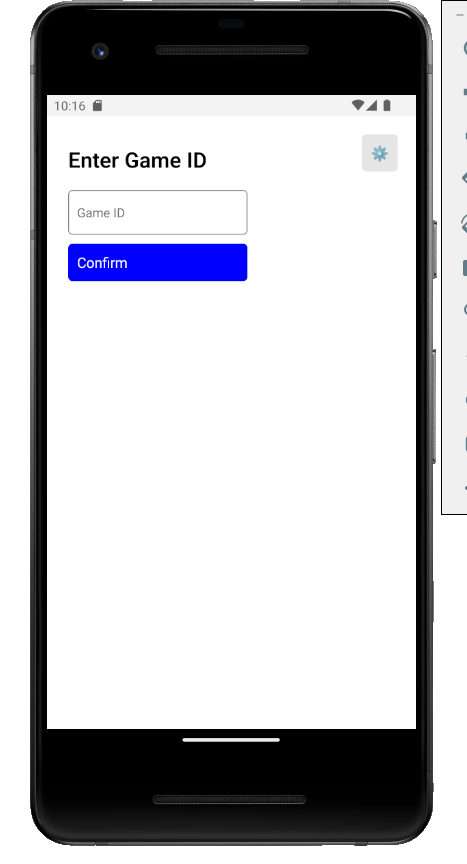
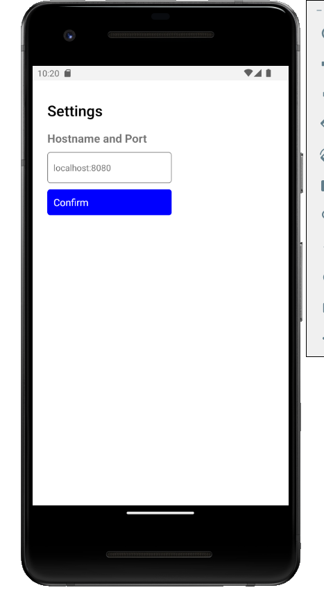
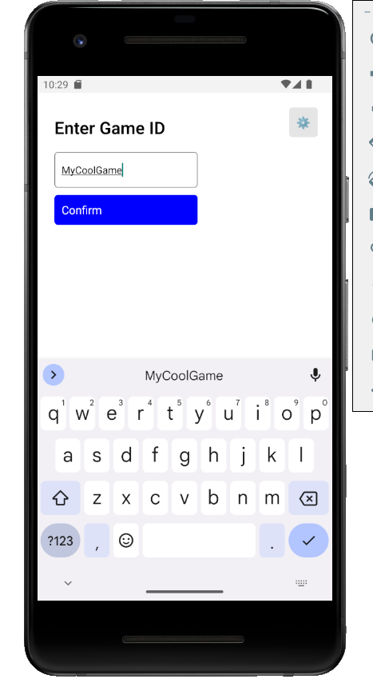
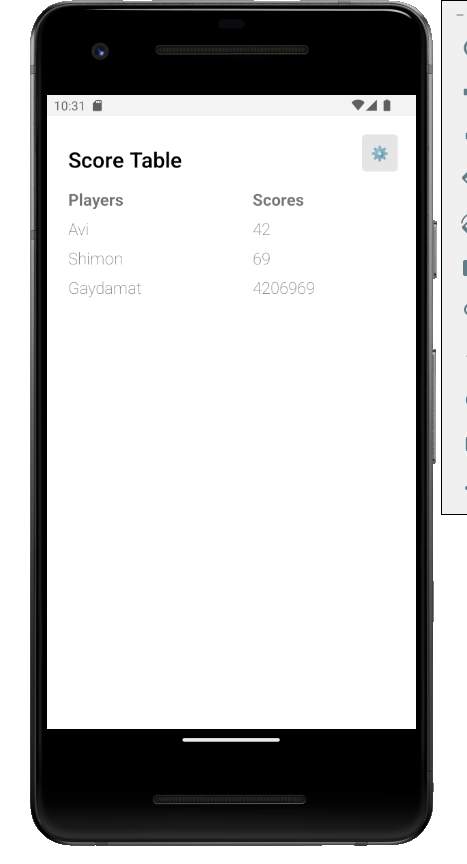

# Score Table - Android React Native Application

## Install

Either run the application in an Android emulator or install the provided APK on your phone.

### Emulator

#### Prerequisite

To run in an emulator you'll need: Android Studio, Node.js and JDK11. Use [this tutorial](https://reactnative.dev/docs/environment-setup) to set up the environment (everything up until the "`Running your React Native application`" part).

#### Running in an emulator

1.	Open a terminal in the directory of the project.
2.	Install the required Node.js packages by running: `npm install`
3.	Run the command: `npx react-native start`
4.	Run the application in an emulator:
	*	The way I found to work most consistently: Open another terminal in the same directory and run: `npx react-native run-android`
	*	A way I found to work less consistently: Press the `a` key on the terminal where you ran `npx react-native start`

Note: Whatever way you choose to run the application in an emulator, notice that it takes a while for it to load. Sometimes it the application pops up, closes, and then reopens again. Sometimes it loads in the background and you have to navigate to it manually. Sometimes it fails to connect with the debug server and you have to close everything (kill any `node.exe` and `adb.exe` application that are running in the background and try again).

### Phone

Copy the APK from `./android/app/build/outputs/apk/release/app-release.apk` to your phone and install it.

## How to use

1.	Click the gear icon on the top right of the main screen.

	
2.	Enter the IP (or hostname) and the port of the machine running the server that the application should contact. Press "Confirm" afterwards (or press "Enter" on the keyboard).
	*	Write it in this format: `ip:port`. The port is most probably `8080`.
	*	If you are running an emulator and the server on the same machine, use the real IP of the machine inside whatever network you're connected on, and not `localhost` as it won't work.

	
3.	Enter the ID of the game you want to view its score and press "Confirm" (or press "Enter" on the keyboard).

	
4.	If you entered the correct `ip:port`, the server is running, and God gave you his blessing, then the score table should display. Otherwise, nothing will happen.

	

## Reliability

When tested on the emulator it worked for me 100% of the time. When I tested on my phone it didn't work once. I tried all kind of different things to make it work, but eventually I gave up. After a while I thought of trying the same APK on a different phone and it worked! So here are the specs of the phone it was tested on:
*	Phone: Samsung S4
*	Model: `GT-I9515`
*	Android: `5.0.1`